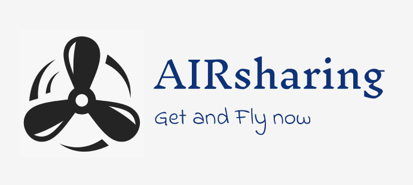

# “Индивидуальный проект по теме: Разработка приложения сети аэрошеринга
## 
"Приложение сети Аэрошеринга"

Приложение для аэрошеринга позволяет людям, имеющим лётное удостоверение, арендовать самолеты небольшого типа для личных или рабочих целей

**Для использования приложения необходимо:**
* подключение к сети интернет,
* операционная система Windows. 
* Visual Studio 2022

* нажать на раскрывающийся список с названием "Code" на странице GitHub
* Нажать "Download ZIP"
* Распаковать файл
* запустить приложение

### 

- Регистрация / Авторизация пользователя
- Хранение и изменение данных пользователя
- Поиск по категориям
- Просмотр, загрузка файлов
- Назначение прав доступа к определенному файлу
- Реализация механизма обмена сообщений в реальном времени

